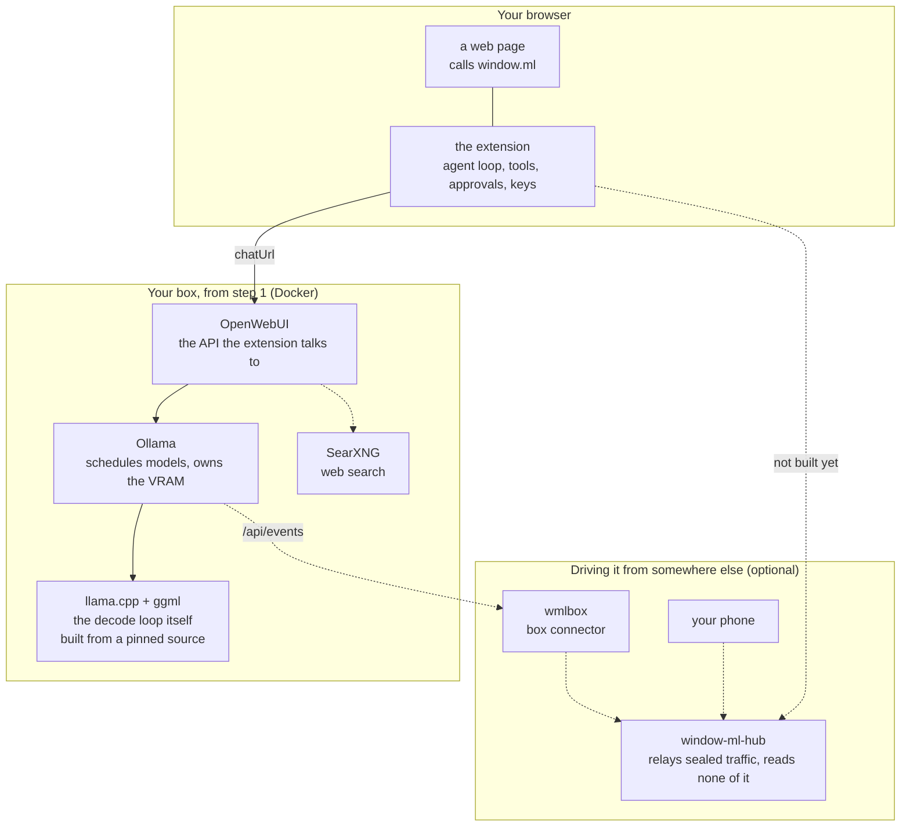

# Full local setup — from nothing to a `window.ml` that does real work

This is the **backend** half of setup: it stands up a complete local stack with
Docker so `window.ml` has something powerful to talk to. If you already have an
OpenWebUI/Ollama server running, skip straight to [SETUP.md](SETUP.md) (the
extension side).

## What you'll have at the end

A single-command local stack — **OpenWebUI + Ollama + SearXNG** — with a couple
of tool-capable models and web search wired in. Enough that `window.ml` is
*immediately* useful. From any page's console (or a userscript) you'll be able to:

- **Summarize a YouTube video** and ask follow-ups, in-page — the bundled
  [example](../examples/README.md), using a server-side transcript tool + web search.
- **Curate a feed by a text policy** — classify DOM with a JSON `schema` and hide
  what fails your rules (rage-bait, crypto shilling, …).
- **OCR + reason over images** — `ml.read()` an image, then `ml.chat()` about it.
- **Let a model call your own tools** (`ml.step`) or OpenWebUI's built-in ones
  (web search) — agents that touch your tab.

…all running on your own box, free at the margin (no per-token meter). This doc
gets the *server* ready; [SETUP.md](SETUP.md) points the *extension* at it.

> **Just want cloud models (Claude/GPT/OpenRouter)?** You still want OpenWebUI
> (steps 1, 3–6 below) — skip Ollama and the model pulls, and add a provider
> connection per [CLOUD-MODELS.md](CLOUD-MODELS.md) instead of step 2.

## The layers, and which you actually need

Only three of the pieces below are required. Solid arrows are the path a normal setup takes; dashed ones
are optional, and the one marked "not built yet" is a real gap rather than a configuration you are
missing.



Every arrow into the hub is an outward dial. The hub never connects to anything, which is the property its
security argument rests on.

| Layer | What it gives you | Need it? |
| --- | --- | --- |
| **Ollama** | decides which model is loaded, where it goes and how long it stays, and owns the VRAM | Required |
| **llama.cpp + ggml** | the decode loop that actually runs the model. Ollama builds it from a pinned source (`LLAMA_CPP_VERSION`), so you never install it yourself | Comes with Ollama |
| **OpenWebUI** | what `chatUrl` points at: the model list, chat completions, server-side tools | Required |
| **The extension** | `window.ml` on the page, and everything that matters: the agent loop, the tools, the approvals, the keys | Required |
| **SearXNG** | web search for OpenWebUI's own tools (step 4) | Optional |
| **The [Ollama fork](FORKED-BACKENDS.md)** | capacity, per-GPU attribution, activity and the `/api/events` stream, which is what the resource panel draws | Optional. A stock Ollama says "not reported" and the rest still works |
| **The [llama.cpp fork](https://github.com/parawanderer/llama.cpp)** (`slop`) | what the placement work is fit against: per-layer expert routing recorded from real traffic (`LLAMA_ROUTING_STATS`, read back over `GET /routing`) and the offline `bench/placement` harness, because nothing in a GGUF says how skewed a mixture of experts routes. Also model architectures ahead of upstream: glm5next, its vision tower, and the pieces they need | Required for the placement engine. Otherwise only if you want those models. Point a build at a checkout with `OLLAMA_LLAMA_CPP_SOURCE`; the default fetches upstream at the pin |
| **The [OpenWebUI fork](FORKED-BACKENDS.md)** | `POST /api/v1/tools/id/{id}/execute`, which runs one configured tool on its own. This is what `ml.dynamicTools` calls, so the agent can run a server tool with arguments it chose instead of handing the whole loop to a model | Needed for `ml.dynamicTools`. Everything else works without it |
| **[window-ml-hub](https://github.com/parawanderer/window-ml-hub)** | watching or driving a runtime from another device | Optional, step 7 |
| **`wmlbox`** | republishes a box's telemetry through a hub | Optional, needs the Ollama fork and a hub |

## Prerequisites

- A machine with **Docker + Docker Compose** ([install](https://docs.docker.com/engine/install/)).
- For GPU acceleration: an **NVIDIA GPU + the [NVIDIA Container Toolkit](https://docs.nvidia.com/datacenter/cloud-native/container-toolkit/latest/install-guide.html)**.
  CPU-only works but is slow — remove the `deploy:` block in step 1 to run without a GPU.
- ~**30–60 GB** of disk for a couple of models.

---

## 1. Bring up the stack

Create a folder and two files.

`docker-compose.yml`:

```yaml
services:
  ollama:
    image: ollama/ollama:latest
    container_name: ollama
    restart: unless-stopped
    volumes:
      - ollama:/root/.ollama
    # NVIDIA GPU — needs the NVIDIA Container Toolkit on the host.
    # Delete this whole `deploy:` block to run CPU-only.
    deploy:
      resources:
        reservations:
          devices:
            - driver: nvidia
              count: all
              capabilities: [gpu]

  open-webui:
    image: ghcr.io/open-webui/open-webui:main
    container_name: open-webui
    restart: unless-stopped
    depends_on: [ollama]
    ports:
      - "3000:8080"
    environment:
      - OLLAMA_BASE_URL=http://ollama:11434
      # Web search via the SearXNG container below (env names vary by version;
      # if search stays off, flip it on in the Admin UI — step 4).
      - ENABLE_WEB_SEARCH=true
      - WEB_SEARCH_ENGINE=searxng
      - SEARXNG_QUERY_URL=http://searxng:8080/search?q=<query>
    volumes:
      - open-webui:/app/backend/data

  searxng:
    image: searxng/searxng:latest
    container_name: searxng
    restart: unless-stopped
    volumes:
      - ./searxng:/etc/searxng:rw
    environment:
      - SEARXNG_BASE_URL=http://searxng:8080/

volumes:
  ollama:
  open-webui:
```

`searxng/settings.yml` — the two settings that matter are **`json` in
`search.formats`** (OpenWebUI queries the JSON API, which SearXNG serves *off* by
default — the #1 "web search returns nothing" cause) and **`limiter: false`**
(its bot-detection otherwise blocks OpenWebUI's requests; fine because this
instance is internal-only):

```yaml
use_default_settings: true
server:
  secret_key: "REPLACE_ME"      # run: openssl rand -hex 32
  limiter: false
  image_proxy: true
search:
  formats:
    - html
    - json
```

Then:

```bash
mkdir -p searxng    # make sure the settings file exists before starting
# (create the two files above, set a real secret_key)
docker compose up -d
docker compose ps   # all three should be "running"
```

OpenWebUI is now at **`http://<host>:3000`**.

## 2. Pull a couple of models

`window.ml`'s tool features (the summarizer, web search, agents) rely on the
model being good at **tool calling**, and the **Qwen3** family is currently the
most reliable at it — so these are Qwen3. Pull via the Ollama container:

| Pull command | ~VRAM (Q4) | What it's for |
| --- | --- | --- |
| `docker exec ollama ollama pull qwen3:8b` | ~6 GB | Lightweight & fast; runs on basically any GPU. Great default for light tasks / classifiers. |
| `docker exec ollama ollama pull qwen3:32b` | ~20 GB | The 24 GB-class (3090/4090) workhorse; the summarizer's default. **Under 24 GB VRAM?** use `qwen3:14b` (~10 GB) instead. |
| `docker exec ollama ollama pull qwen2.5vl` | ~6 GB | A **vision** model for `ml.read()` OCR and image questions. |

Tiny card or just testing? `qwen3:4b` (~3 GB) is a capable, tool-able featherweight.

## 3. First-run OpenWebUI

1. Open `http://<host>:3000`. **The first account you create becomes the admin.**
2. **Settings → Account → API keys → create one.** You'll paste this into the
   extension popup later.
3. Your endpoint for the extension is `http://<host>:3000/api/chat/completions`,
   API format **OpenAI**.

## 4. Turn on web search

SearXNG is already running from step 1. First, sanity-check it's serving JSON
(run from the OpenWebUI container so you test the real network path):

```bash
docker exec open-webui sh -c 'curl -s "http://searxng:8080/search?q=test&format=json" | head -c 200'
```

You want JSON back. HTML/403 → re-check `settings.yml` (the `json` format and
`limiter: false`) and `docker compose restart searxng`.

There are **two** ways to use it, and they're separate:

- **In OpenWebUI's own chat UI:** Admin Panel → Settings → Web Search → enable,
  Engine = `searxng`, Searxng Query URL = `http://searxng:8080/search?q=<query>`.
- **For `window.ml` / any API client** (e.g. the summarizer example): the
  built-in feature above is **UI-only — it does not run over OpenWebUI's API**
  ([open-webui#12045](https://github.com/open-webui/open-webui/issues/12045)). So
  register a **web-search workspace tool** instead:
  [`examples/searxng_search.py`](../examples/searxng_search.py) → paste it as a
  Tool in the workspace (id auto-derives to `searxng_web_search`) and set its
  `SEARXNG_URL` valve to `http://searxng:8080/search`. That one *does* execute via
  the API, exactly like the transcript tool.


## 5. Point the extension at it

Now do [SETUP.md](SETUP.md): load the unpacked extension, open its popup, and set:

- **Chat completions URL** → `http://<host>:3000/api/chat/completions`
- **API key** → the one from step 3
- **Model** → hit **Load**, pick `qwen3:32b` (or your choice)
- **API format** → **OpenAI**
- **OCR model** → `qwen2.5vl` (so `ml.read()` works)

**Save & Test.** If you get a reply, the whole stack is live.

## 6. Do something real

Open a page's console and try it, or jump straight to the flagship example:

```js
await ml.chat("Say hi in one word.");
await ml.read(document.images[0]);                 // OCR an image on the page
```

- **YouTube summarizer** (streaming, transcript tool + web search):
  [examples/README.md](../examples/README.md) — install its transcript tool, then
  load the userscript.
- **Feed curation, agents, structured extraction:** see the
  [API reference](API.md) (the `schema`, `ml.step`, and `toolIds`
  sections).

## 7. Optional: a hub, to watch it from elsewhere

Read this part as a status report rather than a step. [window-ml-hub](https://github.com/parawanderer/window-ml-hub)
is a relay that lets a phone or another machine watch and drive a runtime, and it is built to be trusted with
nothing: runtimes dial out and never listen, every principal is a key, traffic is sealed end to end, and the hub
sees ciphertext and routing metadata only.

What works today is the telemetry direction. `wmlbox` pairs with a patched Ollama box and republishes its
`/api/events` stream through a hub, sealed and unchanged, and a client can subscribe to it. **What does not exist
yet is the extension's own connector**, so no agent in your browser is reachable through a hub, and nothing in
step 5 changes if you run one. Skip this section unless you want the telemetry path or want to read the design.

```bash
git clone https://github.com/parawanderer/window-ml-hub && cd window-ml-hub
cp .env.example .env && $EDITOR .env      # set WMLHUB_HUB_NAME
docker compose up -d
docker compose exec hub wmlhub invite create
```

That publishes on `127.0.0.1:8787` only, deliberately: put TLS in front of it before anything reaches it from
another device. Tailscale and Caddy are both written up, along with registration modes, backups and every setting,
in [the hub's SELF_HOSTING.md](https://github.com/parawanderer/window-ml-hub/blob/main/docs/SELF_HOSTING.md). The
design and its security argument are in [docs/spec/RUNTIME_HUB.md](spec/RUNTIME_HUB.md).

## Troubleshooting

| Symptom | Fix |
| --- | --- |
| Web search does nothing / no sources | SearXNG's `json` format not enabled, or its `limiter` is on. Test with the `docker exec … curl … &format=json` in step 4. |
| A tool call *still* returns empty (`finish_reason: "tool_calls"`) | `window.ml` already forces server-side execution; if it still fails, your OpenWebUI build labels that mode with a string it doesn't try — set **Admin → Settings → Models → Function Calling → Legacy/Default** as a fallback. |
| Models list is empty in OpenWebUI / the extension's **Load** | You haven't pulled a model yet — do step 2, then reload. |
| GPU not used (slow, CPU-bound) | NVIDIA Container Toolkit isn't installed/working, or you removed the `deploy:` block. `docker exec ollama nvidia-smi` should show the GPU. |
| Extension-side issues (URL, `ml is not defined`, HTTP 400/405) | See [SETUP.md → Troubleshooting](SETUP.md#troubleshooting). |
