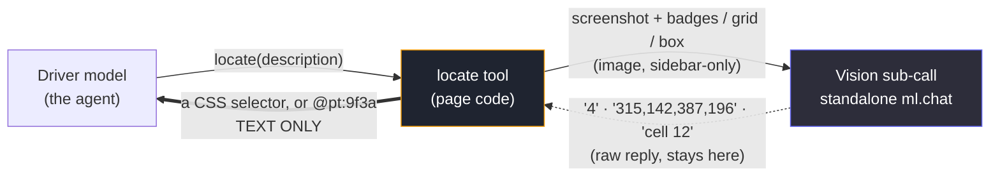
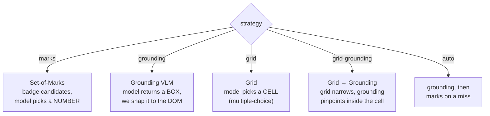
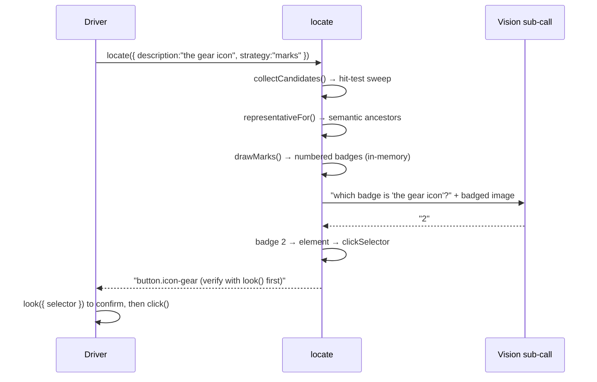
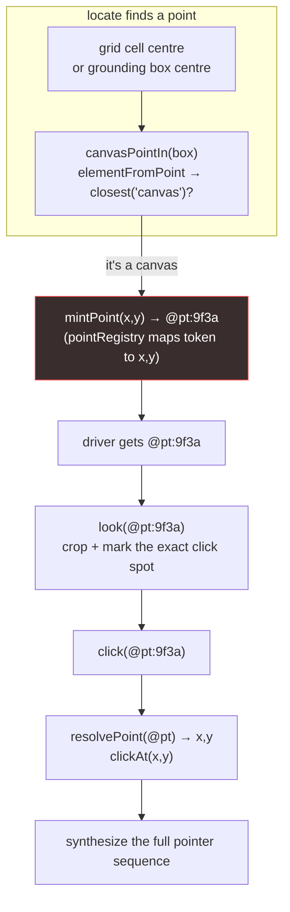
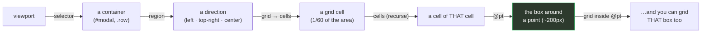
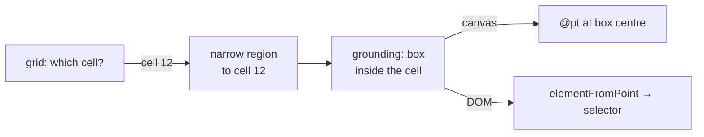
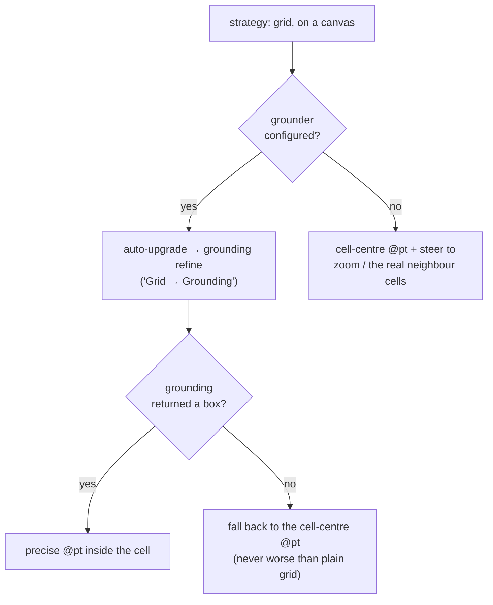
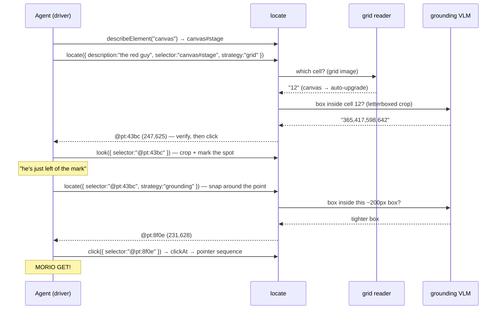

# How `locate` sees: the vision-to-click pipeline

> A field guide to the most elaborate machine in this codebase.
>
> `ml.locate` finds an on-screen control **by describing how it looks** — for
> unlabelled icon buttons, custom widgets, or a whole scene painted onto a
> `<canvas>` with no DOM underneath. This document explains, with boxes and
> arrows, exactly how a sentence like *"the red guy in a cap"* becomes a click.
>
> Fair warning: it is cursed. Not badly-written cursed — *conceptually* cursed.
> We run a coordinate-triangulation search across two or three language models
> and five zoom tiers to approximate what a single DOM node + click handler would
> hand you for free. The reason is simple and sad: **a `<canvas>` threw away all
> the structure, so we reconstruct "where is the thing" from raw pixels.** The
> whole feature is a monument to the absence of an accessibility tree.

---

## The one primitive: hit-testing, not selectors

Everything rests on **`document.elementFromPoint(x, y)`** — "what element is at
this pixel?" — *not* on matching CSS selectors. This is deliberate: it works on
pages with zero accessibility markup (a bare `<div>` with a synthetic click
handler), because a click handler is invisible to the DOM but the *pixel* is
real.

```
  collectCandidates()                     representativeFor(hit)
  sweep the viewport on a grid            climb from the raw pixel-hit
  of sample points:                       up to the meaningful element:

   · · · · · · · · · ·                       <span> ← elementFromPoint
   · ·[X]· · ·[Y]· · ·                         │  (a leaf, not clickable)
   · · · · · · · · · ·                         ▼
   · · ·[Z]· · · · · ·                       <button>  ← nearest semantic
   · · · · · · · · · ·                         or the cursor:pointer boundary
        │                                      (the one convention non-semantic
        ▼                                       React UIs still keep)
   topmost element at each point
   (occluded ones excluded for free)
```

So the raw material is always *pixels → elements*. The vision model's only job
is to tell us **which** pixel, and it does that in one of four dialects.

---

## The delegation boundary (read this first)

Every vision call is a **standalone sub-call** — a fresh `ml.chat(prompt, {
images })` with its own empty context. The screenshot and the model's raw reply
**never enter the driver's conversation.** Only a short text currency crosses
back: a **CSS selector** (DOM) or an **`@pt:<hex>` token** (canvas).



This is why a **text-only driver can drive vision**: it never has to see the
image. It says *"find the red guy,"* gets back `@pt:9f3a`, and clicks it. The
badged/gridded images ride a separate `render` channel to the debug sidebar and
are never injected into the model's history.

---

## The four dialects (`strategy`)



Why four? Because each trades off differently:

| dialect | model needs | can hallucinate a coord? | best for |
|---|---|---|---|
| **marks** | any vision model | no (picks a number) | cluttered DOM, many similar controls |
| **grounding** | a coordinate VLM (qwen2.5vl) | yes (it emits x,y) | a clear target, a canvas point |
| **grid** | any vision model | no (picks a cell) | dense scenes, no coordinate training |
| **grid-grounding** | a grounding VLM | no then yes | small target on a busy page/canvas |

---

## Case 1 — the DOM (there's a real element to snap to)

The happy case. The mechanism localizes a region; `elementFromPoint` turns that
into an actual node; we return its **CSS selector** as the currency.

### Set-of-Marks, end to end

```
1. screenshot          2. badge the candidates       3. ask the model
   the viewport           (drawn in memory, dpr-scaled)

  ┌───────────────┐      ┌───────────────┐            "The screenshot has
  │  ♥   ⚙   ⌕    │      │ ①♥  ②⚙  ③⌕   │            numbered badges. Which
  │      ▣        │  ──▶ │     ④▣        │  ──vision──▶ badge is 'the gear
  │  ▶   ✎   ✕    │      │ ⑤▶  ⑥✎  ⑦✕   │            icon'? Reply a number."
  └───────────────┘      └───────────────┘                    │
                                                              ▼  "2"
4. snap back                          ┌──────────────────────────┐
   badge 2 → its element → selector   │ returns: button.icon-gear │
                                       └──────────────────────────┘
```



**Grounding** in the DOM is the same shape, but the model returns a *box* instead
of a badge number. We invert the letterbox (below) to a viewport box, take its
centre, `elementFromPoint` there, and return that element's selector. The model
only has to be *directionally* right — the DOM hit-test does the precise part.

### The letterbox (how grounding coordinates stay sane)

A grounding VLM was trained on square-ish images and emits coordinates in some
convention (0–1000, 0–100%, pixels…). To make **one** number cover every
convention and every crop shape, we letterbox the search region into a fixed
**1000×1000 square** before sending it, then project the model's answer back:

```
  region (any shape)          letterbox → 1000×1000 square        model says
  ┌──────────────────┐        ┌──────────────────┐               "x=315,y=560"
  │                  │        │▓▓▓▓▓▓▓▓▓▓▓▓▓▓▓▓▓▓│ ← grey padding    (0–1000)
  │      target      │  ───▶  │                  │                     │
  │        ◎         │        │      target      │                     │
  └──────────────────┘        │        ◎         │                     ▼
                              │▓▓▓▓▓▓▓▓▓▓▓▓▓▓▓▓▓▓│         projectFromSquare():
    (aspect preserved —       └──────────────────┘         ONE scale (the region's
     a stretch would mangle                                 longer side) + the region's
     an arbitrary crop)                                     viewport offset → a pixel
```

`letterboxToSquare` going in, `projectFromSquare` coming back. One scale on both
axes (never a per-axis stretch) so a point maps to a point.

---

## Case 2 — the canvas (there is *nothing* to snap to)

Here's where it gets cursed. A `<canvas>` is one big `<canvas#stage>` element
with **no children**. `elementFromPoint` anywhere inside it returns… the canvas.
There is no node for "the red guy." So we can't return a selector.

Instead `locate` **mints an opaque coordinate token** — `@pt:<hex>` — that maps
to a viewport `{x, y}` in a per-page registry, and hands *that* back as the
currency. The driver copies the token verbatim; it never authors coordinates.



### Clicking a coordinate that isn't an element

`click` decodes the token and **synthesizes the whole pointer/mouse sequence** at
that viewport pixel — because a canvas game listens for raw events, not for a
`.click()` on a node:

```
  clickAt(x, y):   pointerdown → mousedown → pointerup → mouseup → click
                   (all at the same clientX/clientY; canvas reads
                    clientX - rect.left, which the synthetic event satisfies)
```

### `@pt` verification: look at a coordinate

You can't screenshot "an element" that doesn't exist, so `look({ selector:
"@pt:…" })` crops a box **around the point** and draws the exact click spot on
it, so the driver can confirm what it's about to hit:

```
   look({ selector: "@pt:9f3a" })   →   a ~200px crop, click point marked

        ┌───────────────────────┐
        │   🍄        🍄        │       "A crosshair box marks exactly where
        │        ┌──┐           │        a click would land. Is the thing
        │   🍄   │◎ │  🍄       │        under it what I'm after?"
        │        └──┘           │
        │   🍄        🍄        │
        └───────────────────────┘
              ▲ click point
```

---

## The scoping tiers (the fractal zoom)

Any strategy runs inside a **cropped region**, and there are five ways to crop —
each just narrows `region` before the mechanism runs. They stack, coarse → fine,
each using the model's strength at that zoom:



The two that make dense scenes tractable:

- **`region`** — the coarse *directional* crop. A small model can't pick 1-of-60
  numbered cells in a crowd, but it can reliably say *"he's on the left."* So it
  names a direction (`left`, `top-right`, `center`; halves overlap so a
  midline target is safely in both), and the grid then runs over half the area.
- **`@pt` as a universal scope** — the finest tier, and the only one seeded by a
  *verified* view: after `look({ @pt })` shows the target sitting just off the
  mark, `locate({ selector: "@pt:…", strategy: "grid" })` re-searches that exact
  box. Yes — **you can run a grid inside a point.** And a grid of *that*. Fractal
  Where's-Waldo, and it falls out for free because "scope is scope."

---

## `grid` and `grid-grounding`, in full

Grid is multiple-choice classification — no coordinate training, no
hallucinated (x,y), just *"which numbered cell?"* Four details make it converge:

```
  aspect-matched dims          multi-cell pick             marks hand-off
  (wide toolbar → more cols)   (target on a grid line →    (cell holds several
                                1, 2-adjacent, or a 2×2)     DOM elements → a 2nd
   ┌──┬──┬──┬──┬──┬──┐                                       vision call picks by
   │ 1│ 2│ 3│ 4│ 5│ 6│          ┌──┬──┐   the target         badge WITHIN the cell)
   ├──┼──┼──┼──┼──┼──┤          │ 3│ 4│ ← straddles 3+4,
   │ 7│ 8│..│..│..│12│          ├──┼──┤   so pick both
   └──┴──┴──┴──┴──┴──┘          │ 7│ 8│
```

**`grid-grounding`** chains two models: grid coarsely localizes a cell, then
grounding pinpoints *inside* that small cell — the combo for a small target on a
busy page where a plain grid's cell-centre only grazes.



### Canvas auto-upgrade (the free precision win)

On a `<canvas>`, a plain `strategy:"grid"` cell-pick lands on… the canvas, so all
we could return is the **cell centre** — which grazes an off-centre target. But
on a canvas there's *no element to mis-snap to*, so the grounding refine can only
help. So a plain `grid` on a canvas **auto-upgrades to grid-grounding** whenever
a grounder is configured — the model asked for the cheap thing and got the smart
thing. If grounding whiffs, we fall back to the stashed cell centre, so the
upgrade is **never worse** than plain grid.



---

## The loop the driver actually runs

Pulling it together — a canvas target, the way a real agent walks it:



---

## Why it's cursed (a closing meditation)

Read that last diagram back and sit with it. To click one pixel we:

1. screenshotted the page,
2. drew a numbered grid on the screenshot,
3. asked a language model which numbered box,
4. cropped that box and asked a **second** model to point at a pixel,
5. invented a fake coordinate token because there's no element to name,
6. took **another** screenshot to check the coordinate,
7. and re-searched the neighborhood of the coordinate we just invented.

Three models playing warmer/colder over a `<canvas>`, doing gradient descent by
hand. On the DOM, `locate` is the rare escape hatch for the ~5% of controls that
hide from the accessibility tree, and it's almost elegant. On a canvas it is the
*only* tool that can win, and it is glue code all the way down — but the kind of
glue you find yourself weirdly fond of.

The lesson buried in here: the DOM is a gift. A structured, queryable,
semantic map of intent, handed to you for free. `locate` is what it costs to
live without one.

---

*Source map: `builtin-tools.ts` (the `locate`/`look`/`click` tools),
`som.ts` (the hit-test engine + coordinate math, unit-tested standalone),
`util.ts` (the `@pt` registry + `clickAt`). See `CLAUDE.md` for the terse
version and `docs/spec/` for slice-by-slice design notes.*
