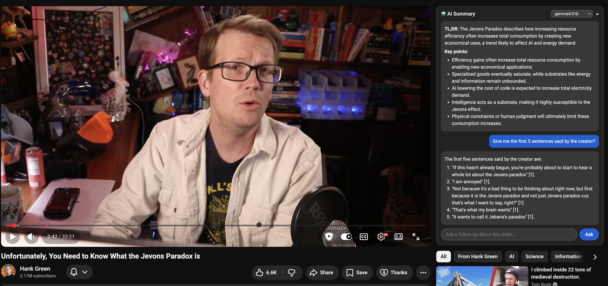

# Examples

## Amazon search filter (agent) — [`amazon_filter.js`](./amazon_filter.js)

A devtools-console snippet: paste it on an Amazon **search results** page and a
local LLM hides the cards you don't want (Sponsored, not shipping today, …). It's
one `ml.agent()` call — the model discovers the DOM itself with the built-in
agent tools (`findByText` → `describeElement` → `countMatches`/`sampleText` →
apply), driven by a task-specific strategy prompt.

It composes **one custom `hideElements` tool** (via `ml.defineTool` + `extraTools`)
on top of the generic `ml.domTools`, showing how you extend the agent — the loop,
step cap, and action all stay on your side. Needs a **tool-capable** model; bigger
models drive the loop more reliably. Edit the `TASK` line to filter differently.

---

## YouTube video summarizer — [`youtube-summarizer.user.js`](./youtube-summarizer.user.js)



A page-context userscript that injects an **AI Summary** card into the YouTube
watch page. It uses [`window.ml`](../README.md) to call an OpenWebUI **server-side
transcript tool**, summarizes the video, and lets you ask follow-up questions —
all inside the page, grounded in the actual transcript.

### What you get

- A themed panel in the right rail (light/dark aware) that survives YouTube's
  in-app navigation between videos.
- **✨ Summarize this video** → a compact, consistent TL;DR + key points, **streamed
  token-by-token** into the panel (via `onToken`), then finalized as formatted markdown.
- A follow-up box to chat about the video (the transcript tool stays available,
  so answers stay grounded). With the optional **SearXNG web-search tool** it also
  searches the web on its own to answer questions beyond the transcript — more
  about the channel/creator, related facts — when a follow-up needs it, and shows
  a row of clickable **source chips** under any web-answered reply.
- A **model dropdown** in the header, populated from `ml.models()`. Defaults to
  `qwen3:32b`; pick any model on your server.
- A **⚠️ warning badge** (hover for details) when the selected model isn't
  available on your server, or doesn't advertise tool-calling support — the two
  things that stop the transcript tool from working.

---

### Prerequisites

1. **OpenWebUI** as your backend — server-side tool calling is an OpenWebUI
   feature (the plain Ollama endpoint can't do it).
2. **The window.ml extension installed and enabled on `youtube.com`.** Set its
   Site access so it runs on YouTube (otherwise `window.ml` won't exist on the
   page and the panel will show a "window.ml not detected" badge).
3. **A tool-capable model pulled in OpenWebUI** — e.g. `qwen3:32b`, or any model
   whose Ollama capabilities include `tools`. (The panel's badge flags models
   that don't.)
4. **The YouTube transcript tool registered in OpenWebUI**, at
   `http://<openwebui>/workspace/tools`. Install it from
   [openwebui.com](https://openwebui.com/posts/youtube_transcript_provider_update_2122025_a2863c56).
   If that link dies, create a new Tool and paste
   [`youtube_transcript_provider_update_2_12_2025.py`](./youtube_transcript_provider_update_2_12_2025.py)
   as the source, with `youtube_transcript_provider_update_2_12_2025` as the **ID**.
5. **(Optional) The SearXNG web-search tool** — lets follow-ups answer questions
   beyond the transcript (channel/creator, related facts). Register
   [`searxng_search.py`](./searxng_search.py) as a Tool in OpenWebUI's workspace
   (its id auto-derives to `searxng_web_search`), and point its `SEARXNG_URL`
   valve at a running SearXNG (see [FULL-SETUP.md](../docs/FULL-SETUP.md)).
   Set `WEB_SEARCH_TOOL_ID = ""` in the script to skip it.

   > **Why a workspace tool and not OpenWebUI's built-in Web Search?** The
   > built-in feature only runs in OpenWebUI's *UI* agent loop — it does **not**
   > execute over the `/api/chat/completions` API that `window.ml` uses (verified
   > on OpenWebUI 0.10.2; [open-webui#12045](https://github.com/open-webui/open-webui/issues/12045)).
   > A workspace tool does, which is why this ships its own.

### Install

Use the **[User JavaScript and CSS](https://chromewebstore.google.com/detail/user-javascript-and-css/nbhcbdghjpllgmfilhnhkllmkecfmpld?hl=en)**
extension: add a rule for `https://www.youtube.com/*`, paste the contents of
[`youtube-summarizer.user.js`](./youtube-summarizer.user.js), and enable it on
`youtube.com`. Open any video — the card appears in the right rail.

> **Why not Tampermonkey?** It *should* work (it runs in the page's main world,
> which is what `window.ml` needs), but on some setups its internal messaging
> breaks on YouTube (`content.js … Cannot read properties of undefined (reading
> 'addListener')`) and the panel never loads. User JavaScript and CSS is the
> tested host here. See the troubleshooting table.

### Configuration

The model is selectable at runtime from the header dropdown. To change the
**default** model or the transcript tool, edit the top of the script:

```js
const DEFAULT_MODEL      = "qwen3:32b";                             // pre-selected model
const TRANSCRIPT_TOOL_ID = "youtube_transcript_provider_update_2_12_2025"; // OpenWebUI tool *id*
const TRANSCRIPT_FN      = "get_youtube_transcript";               // the tool's *function* name
const WEB_SEARCH_TOOL_ID = "searxng_web_search";                   // the SearXNG *workspace tool* id ("" to disable)
const WEB_SEARCH_FN      = "search_web";                           // that tool's function name
```

> **Tool id vs. function name** — these are two different things and both matter.
> `TRANSCRIPT_TOOL_ID` is what *enables* the tool server-side (`tool_ids`).
> `TRANSCRIPT_FN` is the function name the model actually *calls*, and it's named
> in the prompt so the model reliably invokes it. If you swap the tool, update
> both.

---

### Troubleshooting & edge cases

| Symptom | Cause | Fix |
| --- | --- | --- |
| **Panel never appears** | The userscript isn't running in the page's main world, or `window.ml` isn't present. | Use **User JavaScript and CSS** (not Tampermonkey) and make sure the window.ml extension has Site access on `youtube.com`. In the console, `typeof window.ml` should be `"object"`. |
| **"window.ml not detected" badge** | The window.ml extension isn't active on this page. | Click the extension icon / enable Site access for `youtube.com`, then reload. |
| **Summary bubble is empty / nothing inserts** (but the GPU spins up) | OpenWebUI handed back an *unexecuted* tool call (`content: ""`, `finish_reason: "tool_calls"`) instead of running the tool. This happens in **Native** function-calling mode — the tool's code lives on the server, so the page can't run it. | The extension now auto-forces the server-side execution loop (`params.function_calling`), retrying across version labels. If it still fails, set this model's **Function Calling → Legacy** (v0.10.0+) / **Default** (older) in OpenWebUI's model settings. |
| **⚠️ "isn't available on your server"** | The selected model isn't in `ml.models()`. | Pull it in OpenWebUI, or pick another model from the dropdown. |
| **⚠️ "doesn't advertise tool-calling support"** | The model's Ollama capabilities don't include `tools`. | Pick a tool-capable model (e.g. a `qwen3` variant). Note: for cloud/non-Ollama models the capability is *unknown*, so no badge shows — it may still work. |
| **Model just says "the transcript is available…"** | The model retrieved the transcript but didn't summarize it. | The prompt is hardened against this; if a weaker model still hedges, switch to a stronger one. |
| **Follow-ups never web-search / search errors** | The `searxng_web_search` tool isn't registered, its `SEARXNG_URL` valve is wrong, or SearXNG lacks JSON output. | Register [`searxng_search.py`](./searxng_search.py) and point its valve at your SearXNG (JSON format on); or set `WEB_SEARCH_TOOL_ID = ""` to remove it. **Note:** OpenWebUI's built-in Web Search won't work here — it's UI-only over the API (that's why this tool exists). |
| **`Server-side tool_ids requires OpenWebUI`** | Your window.ml endpoint is the Ollama-native format. | Point the extension at OpenWebUI's `/api/chat/completions` (OpenAI format). |
| **Red `Blocked script execution in 'about:blank'…` console spam** | The injector runs in every frame; Chrome blocks the sandboxed ad/utility iframes *before any code runs*. | Harmless — it doesn't affect the panel. Filter the console with `-Blocked script execution` if it bothers you. |

### How it works (for hacking on it)

- **Server-side tools, one call.** `ml.createChat({ toolIds: [...] })` keeps the
  transcript tool (and the `search_web` tool) available on every turn; the model
  calls whichever it needs and OpenWebUI runs it and returns a finished answer —
  no client-side agent loop. The whole flow lives in the userscript; `window.ml`
  stays a primitive. Both are **workspace tools** because only those execute over
  OpenWebUI's API (its built-in Web Search is UI-only).
- **Trusted Types safe.** YouTube enforces `require-trusted-types-for 'script'`,
  so the panel is built entirely with `createElement`/`textContent` (no
  `innerHTML`), and a tiny markdown renderer returns real DOM nodes.
- **SPA aware.** It re-mounts and resets the chat on `yt-navigate-finish` when
  you move between videos.
- **Streamed.** `chat.chat(prompt, { onToken })` paints tokens into a live bubble
  as they arrive, then swaps in rendered markdown when the reply completes.
